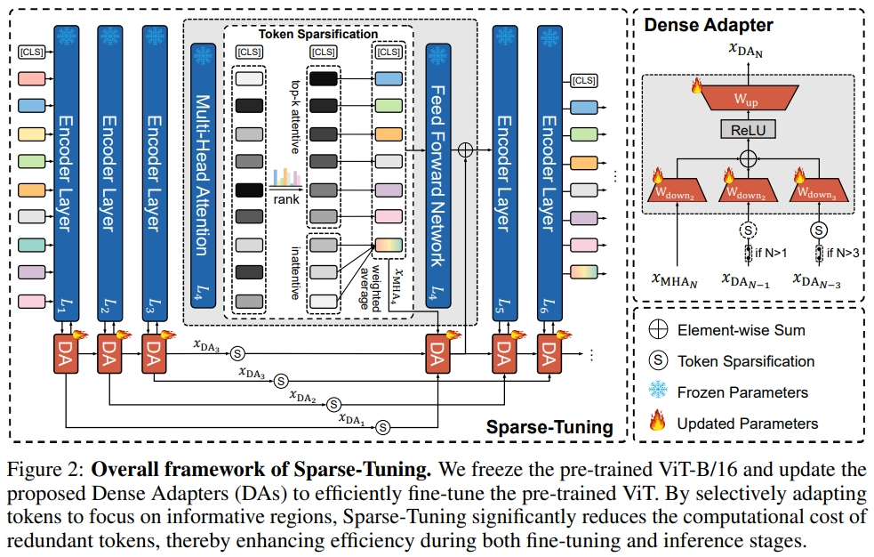

# Sparse-Tuning: Adapting Vision Transformers with Efficient Fine-tuning and Inference
Official PyTorch implementation of our paper 
* **Title**: [Sparse-Tuning: Adapting Vision Transformers with Efficient Fine-tuning and Inference](https://arxiv.org/pdf/2405.14700)
* **Authors**: [Ting Liu](https://github.com/liuting20), [Xuyang Liu](https://xuyang-liu16.github.io/), Liangtao Shi, [Zunnan Xu](https://kkakkkka.github.io/), [Siteng Huang](https://kyonhuang.top/), [Yi Xin](https://synbol.github.io/), Quanjun Yin
* **Institutes**: National University of Defense Technology, Sichuan University, Hefei University of Technology, Tsinghua Universtity, Westlake University, and Nanjing University  

  

In this paper, we propose **Sparse-Tuning**, a novel tuning paradigm that substantially enhances both fine-tuning and inference efficiency for pre-trained ViT models. Sparse-Tuning efficiently fine-tunes the pre-trained ViT by sparsely preserving the informative tokens and merging redundant ones, enabling the ViT to focus on the foreground while reducing computational costs on background regions in the images. To accurately distinguish informative tokens from uninformative ones, we introduce a tailored Dense Adapter, which establishes dense connections across different encoder layers in the ViT, thereby enhancing the representational capacity and quality of token sparsification. Empirical results on VTAB-1K, three complete image datasets, and two complete video datasets demonstrate that Sparse-Tuning reduces the GFLOPs to **62%-70%** of the original ViT-B while achieving state-of-the-art performance.

  

:pushpin: We confirm that the relevant code and implementation details will be uploaded recently. Please be patient.

## Contact
For any question about our paper or code, please contact [Ting Liu](mailto:liuting20@nudt.edu.cn) or [Xuyang Liu](mailto:liuxuyang@stu.scu.edu.cn).
